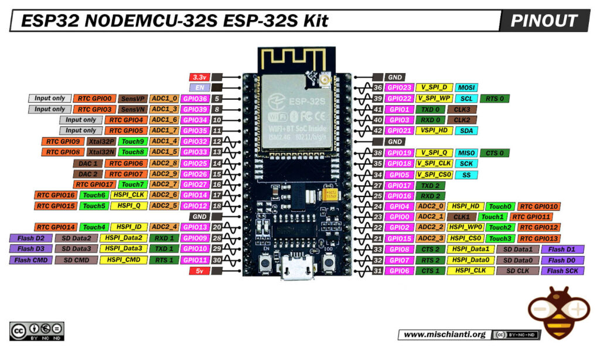

# ESP32 加密傳輸 與 樹梅派解碼

[期末專題報告](https://docs.google.com/presentation/d/1dgE1UflbfET3RkeLtujjp4L4WDkh4RkqZj0S-r6HGY4/edit?usp=sharing)

## 組員
- 林昀佑
- 戴育琪
- 王郁琁

## 硬體安裝

### 接腳配置

|    裝置名稱    |  裝置io  | esp32-GPIO |
|---------------|----------|------------|
|    sh1106     |    VCC   |    3.3v    |
|    sh1106     |    GND   |     GND    |
|    sh1106     |    SCL   |     22     |
|    sh1106     |    SDA   |     21     |
|     dht11     |    VCC   |    3.3v    |
|     dht11     |    GND   |     GND    |
|     dht11     |   DATA   |     14     |



## 系統架構

### 通訊協定
- MQTT over TCP/IP
- Broker: HiveMQ (broker.hivemq.com)
- Port: 1883
- Topic 格式: esp32/群組名稱/MAC地址/類型
  - 例: esp32/group1/AABBCCDD/temp

### 加密系統
1. 加密演算法: ChaCha20
   - 使用自定義常數 (Constants)
   - MAC地址整合到 Nonce
   - 16位元自定義金鑰
   - Topic內容影響加密參數

2. 檔案系統管理
   - SPIFFS儲存系統
   - 加密金鑰存儲 (/encryption.key)
   - WiFi設定檔 (/wifi.txt)
   - 群組設定檔 (/config.txt)

### 主要功能

1. 硬體功能
   - OLED顯示 (SH1106)
   - 溫濕度感測 (DHT11)
   - LED狀態指示
   - 按鈕控制

2. 網路功能
   - WiFi連線管理
   - MQTT通訊
   - 分群組管理
   - 加密傳輸

3. 安全功能
   - ChaCha20加密
   - 設備MAC綁定
   - 群組隔離
   - 配置檔案加密儲存

### 運作流程

1. 啟動階段
   - 初始化硬體
   - 載入配置文件
   - 建立WiFi連線
   - 設置MQTT連線
   - 初始化加密系統

2. 資料傳輸
   - 讀取感測器數據
   - 使用ChaCha20加密
   - 通過MQTT發布
   - 5秒更新一次

3. 加密過程
   - 使用設備MAC作為Nonce一部分
   - Topic影響加密常數
   - 每次傳輸更新加密參數
   - 16字節自定義常數

### Python接收端

1. 功能特點
   - 群組訂閱
   - 即時解密
   - 數據顯示
   - 錯誤處理

2. 使用方式
```bash
# 監聽預設群組
python mqtt_test.py

# 監聽特定群組
python mqtt_test.py --group group2
```

### 安全性考慮

1. 加密保護
   - ChaCha20加密算法
   - MAC地址綁定
   - 動態加密參數
   - 分組隔離

2. 配置安全
   - 本地加密存儲
   - 分離儲存敏感信息
   - 預設值保護

## 開發工具
- 語言: C++ (ESP32), Python (接收端)
- 開發環境: PlatformIO
- 主要依賴:
  - SPIFFS
  - PubSubClient
  - Adafruit GFX
  - DHT Sensor Library
